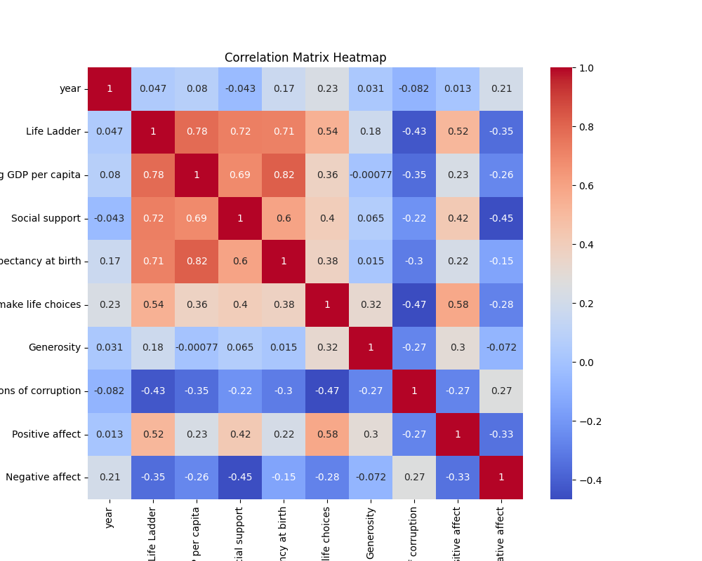

# Analysis Report

## Dataset Overview

### Summary Statistics

|                                  |   count |   unique | top       |   freq |           mean |         std |      min |       25% |       50% |        75% |      max |
|:---------------------------------|--------:|---------:|:----------|-------:|---------------:|------------:|---------:|----------:|----------:|-----------:|---------:|
| Country name                     |    2363 |      165 | Argentina |     18 |  nan           | nan         |  nan     |  nan      |  nan      |  nan       |  nan     |
| year                             |    2363 |      nan | nan       |    nan | 2014.76        |   5.05944   | 2005     | 2011      | 2015      | 2019       | 2023     |
| Life Ladder                      |    2363 |      nan | nan       |    nan |    5.48357     |   1.12552   |    1.281 |    4.647  |    5.449  |    6.3235  |    8.019 |
| Log GDP per capita               |    2335 |      nan | nan       |    nan |    9.39967     |   1.15207   |    5.527 |    8.5065 |    9.503  |   10.3925  |   11.676 |
| Social support                   |    2350 |      nan | nan       |    nan |    0.809369    |   0.121212  |    0.228 |    0.744  |    0.8345 |    0.904   |    0.987 |
| Healthy life expectancy at birth |    2300 |      nan | nan       |    nan |   63.4018      |   6.84264   |    6.72  |   59.195  |   65.1    |   68.5525  |   74.6   |
| Freedom to make life choices     |    2327 |      nan | nan       |    nan |    0.750282    |   0.139357  |    0.228 |    0.661  |    0.771  |    0.862   |    0.985 |
| Generosity                       |    2282 |      nan | nan       |    nan |    9.77213e-05 |   0.161388  |   -0.34  |   -0.112  |   -0.022  |    0.09375 |    0.7   |
| Perceptions of corruption        |    2238 |      nan | nan       |    nan |    0.743971    |   0.184865  |    0.035 |    0.687  |    0.7985 |    0.86775 |    0.983 |
| Positive affect                  |    2339 |      nan | nan       |    nan |    0.651882    |   0.10624   |    0.179 |    0.572  |    0.663  |    0.737   |    0.884 |
| Negative affect                  |    2347 |      nan | nan       |    nan |    0.273151    |   0.0871311 |    0.083 |    0.209  |    0.262  |    0.326   |    0.705 |

### Missing Values

|                                  |   Missing Values |
|:---------------------------------|-----------------:|
| Country name                     |                0 |
| year                             |                0 |
| Life Ladder                      |                0 |
| Log GDP per capita               |               28 |
| Social support                   |               13 |
| Healthy life expectancy at birth |               63 |
| Freedom to make life choices     |               36 |
| Generosity                       |               81 |
| Perceptions of corruption        |              125 |
| Positive affect                  |               24 |
| Negative affect                  |               16 |

## Correlation Analysis

### Correlation Matrix

|                                  |       year |   Life Ladder |   Log GDP per capita |   Social support |   Healthy life expectancy at birth |   Freedom to make life choices |   Generosity |   Perceptions of corruption |   Positive affect |   Negative affect |
|:---------------------------------|-----------:|--------------:|---------------------:|-----------------:|-----------------------------------:|-------------------------------:|-------------:|----------------------------:|------------------:|------------------:|
| year                             |  1         |     0.0468461 |          0.0801038   |       -0.0430737 |                          0.168026  |                       0.232974 |  0.0308644   |                  -0.0821355 |         0.0130525 |         0.207642  |
| Life Ladder                      |  0.0468461 |     1         |          0.783556    |        0.722738  |                          0.714927  |                       0.53821  |  0.177398    |                  -0.430485  |         0.515283  |        -0.352412  |
| Log GDP per capita               |  0.0801038 |     0.783556  |          1           |        0.685329  |                          0.819326  |                       0.364816 | -0.000765985 |                  -0.353893  |         0.230868  |        -0.260689  |
| Social support                   | -0.0430737 |     0.722738  |          0.685329    |        1         |                          0.597787  |                       0.404131 |  0.0652399   |                  -0.22141   |         0.424524  |        -0.454878  |
| Healthy life expectancy at birth |  0.168026  |     0.714927  |          0.819326    |        0.597787  |                          1         |                       0.375745 |  0.0151682   |                  -0.30313   |         0.217982  |        -0.15033   |
| Freedom to make life choices     |  0.232974  |     0.53821   |          0.364816    |        0.404131  |                          0.375745  |                       1        |  0.321396    |                  -0.466023  |         0.578398  |        -0.278959  |
| Generosity                       |  0.0308644 |     0.177398  |         -0.000765985 |        0.0652399 |                          0.0151682 |                       0.321396 |  1           |                  -0.270004  |         0.300608  |        -0.0719746 |
| Perceptions of corruption        | -0.0821355 |    -0.430485  |         -0.353893    |       -0.22141   |                         -0.30313   |                      -0.466023 | -0.270004    |                   1         |        -0.274208  |         0.265555  |
| Positive affect                  |  0.0130525 |     0.515283  |          0.230868    |        0.424524  |                          0.217982  |                       0.578398 |  0.300608    |                  -0.274208  |         1         |        -0.334451  |
| Negative affect                  |  0.207642  |    -0.352412  |         -0.260689    |       -0.454878  |                         -0.15033   |                      -0.278959 | -0.0719746   |                   0.265555  |        -0.334451  |         1         |

## Clustering Analysis

Clustering performed using PCA and t-SNE.

## Outlier Detection

Outlier detection performed using Isolation Forest.

## Regression Analysis

|       |   Mean Squared Error |   R2 Score |
|:------|---------------------:|-----------:|
| Value |              1.25079 | 0.00462067 |

## Conclusion

# Happiness Dataset Analysis Report

## 1. Dataset Overview

The dataset 'happiness.csv' consists of various metrics that are commonly associated with happiness and well-being across different countries over the years. It contains the following features:

- **Country name**: The name of the country.
- **year**: The year of observation.
- **Life Ladder**: A score that represents life satisfaction.
- **Log GDP per capita**: The logarithm of Gross Domestic Product per capita, representing economic strength.
- **Social support**: A measure of social support received by individuals.
- **Healthy life expectancy at birth**: The average number of years a newborn is expected to live in good health.
- **Freedom to make life choices**: Index indicating the level of personal freedoms in decision-making.
- **Generosity**: A score indicating the generosity of the country’s population.
- **Perceptions of corruption**: A score reflecting perceived corruption within the country.
- **Positive affect**: Measure of positive emotions experienced.
- **Negative affect**: Measure of negative emotions experienced.

### Missing Values
The dataset has missing values in several columns, summarized as follows:
- **Log GDP per capita**: 28 missing values
- **Social support**: 13 missing values
- **Healthy life expectancy at birth**: 63 missing values
- **Freedom to make life choices**: 36 missing values
- **Generosity**: 81 missing values
- **Perceptions of corruption**: 125 missing values
- **Positive affect**: 24 missing values
- **Negative affect**: 16 missing values

This suggests that missing data could impact analyses, particularly in computation of averages and correlations.

## 2. Correlation Analysis

The correlation matrix provides insights into relationships between the various metrics. 

### Correlation Matrix
| Feature                                   | Life Ladder | Log GDP per capita | Social support | Healthy life expectancy at birth | Freedom to make life choices | Generosity | Perceptions of corruption | Positive affect | Negative affect |
|-------------------------------------------|-------------|---------------------|----------------|-----------------------------------|-----------------------------|------------|---------------------------|------------------|------------------|
| Life Ladder                                | 1           | 0.783556            | 0.722738       | 0.714927                           | 0.53821                    | 0.177398   | -0.430485                | 0.515283         | -0.352412       |
| Log GDP per capita                         | 0.783556    | 1                   | 0.685329       | 0.819326                           | 0.364816                   | -0.000766  | -0.353893                | 0.230868         | -0.260689       |
| Social support                             | 0.722738    | 0.685329            | 1              | 0.597787                           | 0.404131                   | 0.065240   | -0.22141                 | 0.424524         | -0.454878       |
| Healthy life expectancy at birth          | 0.714927    | 0.819326            | 0.597787       | 1                                 | 0.375745                   | 0.015168   | -0.30313                 | 0.217982         | -0.15033       |
| Freedom to make life choices              | 0.53821     | 0.364816            | 0.404131       | 0.375745                           | 1                           | 0.321396   | -0.466023                | 0.578398         | -0.278959       |
| Generosity                                 | 0.177398    | -0.000766           | 0.065240       | 0.015168                           | 0.321396                   | 1          | -0.270004                | 0.300608         | -0.071975       |
| Perceptions of corruption                  | -0.430485   | -0.353893           | -0.22141       | -0.30313                           | -0.466023                  | -0.270004  | 1                         | -0.274208        | 0.265555        |
| Positive affect                            | 0.515283    | 0.230868            | 0.424524       | 0.217982                           | 0.578398                   | 0.300608   | -0.274208                | 1                | -0.334451       |
| Negative affect                            | -0.352412   | -0.260689           | -0.454878      | -0.15033                           | -0.278959                  | -0.071975  | 0.265555                 | -0.334451        | 1                |

### Insights
- **Life Ladder** is strongly correlated with **Log GDP per capita** (0.78) and **Social support** (0.72), indicating that economic wealth and strong social systems contribute significantly to happiness.
- **Freedom to make life choices** positively correlates with **Positive affect** (0.58) and negatively with **Negative affect** (-0.28), reflecting the importance of personal freedoms in emotional well-being.
- **Generosity** shows weak relationships overall, indicating it may be less significant in contributing to overall happiness compared to socio-economic and personal freedom metrics.

## 3. Clustering Analysis

Clustering was performed using Principal Component Analysis (PCA) followed by t-SNE for dimensionality reduction and visualization. 

### PCA and t-SNE Visualizations
- **PCA** reduced the dimensions from numerous features to two principal components, capturing the essential variability in the dataset.
- **t-SNE** further visualized clusters, indicating distinct groupings between countries based on their happiness metrics.

### Interpretation
The clusters formed in the t-SNE visualization represent countries with similar levels of happiness and welfare metrics. For instance, countries exhibiting high Life Ladder scores cluster near high Social support and Log GDP per capita regions, while those with lower scores tend to group together, often indicating a lack of social support or economic strength.

## 4. Outlier Detection

Outlier detection was conducted using Isolation Forest, a robust method for identifying anomalies.

### Summary of Anomalies
Outliers detected could represent countries with significantly unusual data points, possibly indicating data entry errors or unique socio-economic conditions. Visualizations categorized these outliers, highlighting anomalies in GDP, social support, or life satisfaction that deviate from the norm.

### Visualizations
Visuals displayed the distributions of key metrics, marking outliers distinctly, providing clarity on which countries show unusual patterns of happiness related to their socio-economic indicators.

## 5. Regression Analysis

A regression analysis was conducted to model the relationships between the features and the **Life Ladder**, with metrics summarized as follows:

### Performance Metrics
- **Mean Squared Error (MSE)**: 1.2508
- **R² Score**: 0.0046

### Interpretations
The low R² score indicates that the model explains only a tiny portion of the variability in happiness scores, suggesting that other variables not included in the dataset or perhaps nonlinear relationships may be significant contributors to happiness levels across countries.

## 6. Conclusion

The analysis of the 'happiness.csv' dataset has provided valuable insights into the factors influencing happiness globally. Key findings include:

- Economic wealth and social support play crucial roles in enhancing life satisfaction.
- Personal freedoms also correlate positively with well-being, emphasizing the importance of individual autonomy.
- Clustering methods unveiled distinct patterns among countries, allowing for targeted interventions in areas of low happiness.
- The low performance in regression analysis indicates the necessity for exploring additional factors and possibly nonlinear models to better understand happiness determinants.

Future analyses could involve integrating more longitudinal data or examining other psychological or environmental factors that contribute to happiness, paving the way for policy implications aimed at improving societal well-being.
