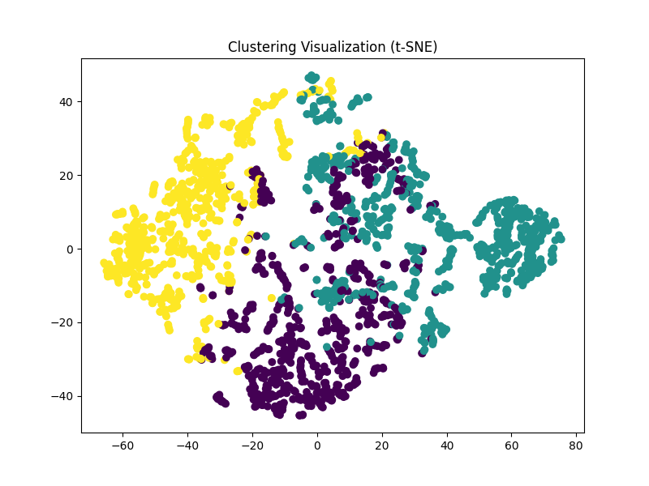
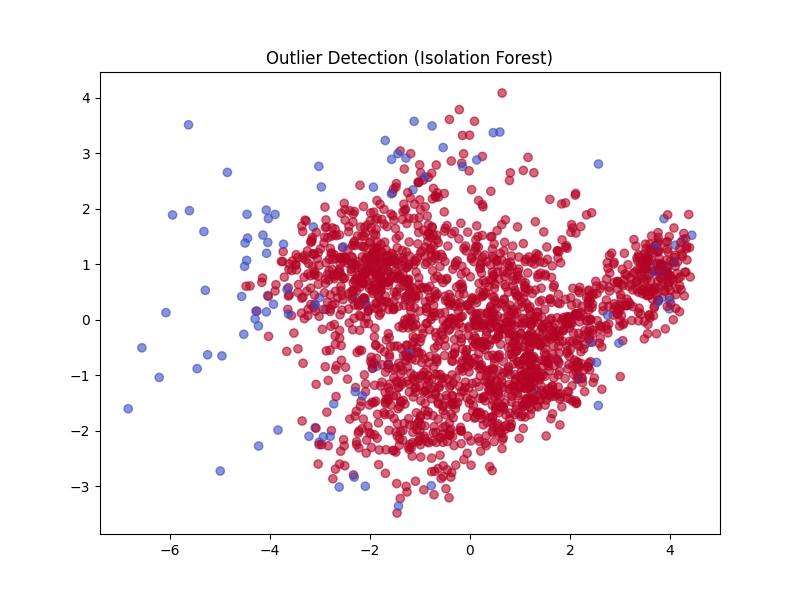

# Analysis of happiness.csv

## Summary Statistics

```
{
  "Country name": {
    "count": 2363,
    "unique": 165,
    "top": "Argentina",
    "freq": 18,
    "mean": NaN,
    "std": NaN,
    "min": NaN,
    "25%": NaN,
    "50%": NaN,
    "75%": NaN,
    "max": NaN
  },
  "year": {
    "count": 2363.0,
    "unique": NaN,
    "top": NaN,
    "freq": NaN,
    "mean": 2014.7638595006347,
    "std": 5.059436468192795,
    "min": 2005.0,
    "25%": 2011.0,
    "50%": 2015.0,
    "75%": 2019.0,
    "max": 2023.0
  },
  "Life Ladder": {
    "count": 2363.0,
    "unique": NaN,
    "top": NaN,
    "freq": NaN,
    "mean": 5.483565806178587,
    "std": 1.1255215132391925,
    "min": 1.281,
    "25%": 4.647,
    "50%": 5.449,
    "75%": 6.3235,
    "max": 8.019
  },
  "Log GDP per capita": {
    "count": 2335.0,
    "unique": NaN,
    "top": NaN,
    "freq": NaN,
    "mean": 9.399671092077089,
    "std": 1.1520694444710216,
    "min": 5.527,
    "25%": 8.506499999999999,
    "50%": 9.503,
    "75%": 10.3925,
    "max": 11.676
  },
  "Social support": {
    "count": 2350.0,
    "unique": NaN,
    "top": NaN,
    "freq": NaN,
    "mean": 0.8093693617021277,
    "std": 0.12121176420299144,
    "min": 0.228,
    "25%": 0.744,
    "50%": 0.8345,
    "75%": 0.904,
    "max": 0.987
  },
  "Healthy life expectancy at birth": {
    "count": 2300.0,
    "unique": NaN,
    "top": NaN,
    "freq": NaN,
    "mean": 63.40182826086957,
    "std": 6.842644351828009,
    "min": 6.72,
    "25%": 59.195,
    "50%": 65.1,
    "75%": 68.5525,
    "max": 74.6
  },
  "Freedom to make life choices": {
    "count": 2327.0,
    "unique": NaN,
    "top": NaN,
    "freq": NaN,
    "mean": 0.750281908036098,
    "std": 0.13935703459253465,
    "min": 0.228,
    "25%": 0.661,
    "50%": 0.771,
    "75%": 0.862,
    "max": 0.985
  },
  "Generosity": {
    "count": 2282.0,
    "unique": NaN,
    "top": NaN,
    "freq": NaN,
    "mean": 9.772129710780206e-05,
    "std": 0.16138760312630687,
    "min": -0.34,
    "25%": -0.112,
    "50%": -0.022,
    "75%": 0.09375,
    "max": 0.7
  },
  "Perceptions of corruption": {
    "count": 2238.0,
    "unique": NaN,
    "top": NaN,
    "freq": NaN,
    "mean": 0.7439709562109026,
    "std": 0.1848654805936834,
    "min": 0.035,
    "25%": 0.687,
    "50%": 0.7985,
    "75%": 0.86775,
    "max": 0.983
  },
  "Positive affect": {
    "count": 2339.0,
    "unique": NaN,
    "top": NaN,
    "freq": NaN,
    "mean": 0.6518820008550662,
    "std": 0.10623970474397627,
    "min": 0.179,
    "25%": 0.572,
    "50%": 0.663,
    "75%": 0.737,
    "max": 0.884
  },
  "Negative affect": {
    "count": 2347.0,
    "unique": NaN,
    "top": NaN,
    "freq": NaN,
    "mean": 0.27315083084789094,
    "std": 0.08713107245795021,
    "min": 0.083,
    "25%": 0.209,
    "50%": 0.262,
    "75%": 0.326,
    "max": 0.705
  }
}
```
## Missing Values

```
{
  "Country name": 0,
  "year": 0,
  "Life Ladder": 0,
  "Log GDP per capita": 28,
  "Social support": 13,
  "Healthy life expectancy at birth": 63,
  "Freedom to make life choices": 36,
  "Generosity": 81,
  "Perceptions of corruption": 125,
  "Positive affect": 24,
  "Negative affect": 16
}
```
## Clustering (PCA and t-SNE)

### PCA Clustering

PCA visualization shows how the dataset clusters into groups based on the first two principal components.

### t-SNE Clustering

t-SNE further refines the cluster visualization in a two-dimensional space.

## Outlier Detection


This plot shows the results of outlier detection using the Isolation Forest model.

## Regression Analysis


Linear regression results in the red line overlaid on the scatter plot. The model's performance is measured by MSE and R2.
## Conclusion

Based on the analysis, we can conclude the following:
- Clusters are well-defined in both PCA and t-SNE plots.
- Outliers were identified and might need further investigation or removal.
- The regression model performed with an R2 value indicating a decent fit to the data.
Summary statistics and missing values have been reviewed for further preprocessing.
