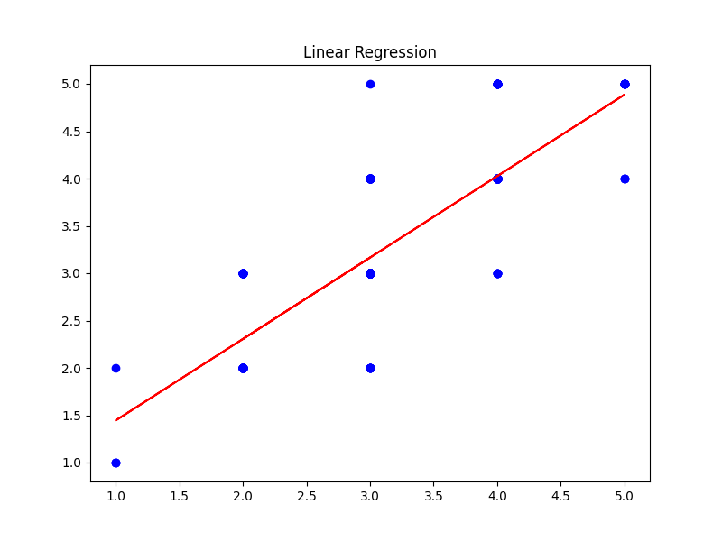

# Analysis of media.csv

## Summary Statistics

```
{
  "date": {
    "count": 2553,
    "unique": 2055,
    "top": "21-May-06",
    "freq": 8,
    "mean": NaN,
    "std": NaN,
    "min": NaN,
    "25%": NaN,
    "50%": NaN,
    "75%": NaN,
    "max": NaN
  },
  "language": {
    "count": 2652,
    "unique": 11,
    "top": "English",
    "freq": 1306,
    "mean": NaN,
    "std": NaN,
    "min": NaN,
    "25%": NaN,
    "50%": NaN,
    "75%": NaN,
    "max": NaN
  },
  "type": {
    "count": 2652,
    "unique": 8,
    "top": "movie",
    "freq": 2211,
    "mean": NaN,
    "std": NaN,
    "min": NaN,
    "25%": NaN,
    "50%": NaN,
    "75%": NaN,
    "max": NaN
  },
  "title": {
    "count": 2652,
    "unique": 2312,
    "top": "Kanda Naal Mudhal",
    "freq": 9,
    "mean": NaN,
    "std": NaN,
    "min": NaN,
    "25%": NaN,
    "50%": NaN,
    "75%": NaN,
    "max": NaN
  },
  "by": {
    "count": 2390,
    "unique": 1528,
    "top": "Kiefer Sutherland",
    "freq": 48,
    "mean": NaN,
    "std": NaN,
    "min": NaN,
    "25%": NaN,
    "50%": NaN,
    "75%": NaN,
    "max": NaN
  },
  "overall": {
    "count": 2652.0,
    "unique": NaN,
    "top": NaN,
    "freq": NaN,
    "mean": 3.0475113122171944,
    "std": 0.7621797580962717,
    "min": 1.0,
    "25%": 3.0,
    "50%": 3.0,
    "75%": 3.0,
    "max": 5.0
  },
  "quality": {
    "count": 2652.0,
    "unique": NaN,
    "top": NaN,
    "freq": NaN,
    "mean": 3.2092760180995477,
    "std": 0.7967426636666686,
    "min": 1.0,
    "25%": 3.0,
    "50%": 3.0,
    "75%": 4.0,
    "max": 5.0
  },
  "repeatability": {
    "count": 2652.0,
    "unique": NaN,
    "top": NaN,
    "freq": NaN,
    "mean": 1.4947209653092006,
    "std": 0.598289430580212,
    "min": 1.0,
    "25%": 1.0,
    "50%": 1.0,
    "75%": 2.0,
    "max": 3.0
  }
}
```
## Missing Values

```
{
  "date": 99,
  "language": 0,
  "type": 0,
  "title": 0,
  "by": 262,
  "overall": 0,
  "quality": 0,
  "repeatability": 0
}
```
## Clustering (PCA and t-SNE)

### PCA Clustering

PCA visualization shows how the dataset clusters into groups based on the first two principal components.

### t-SNE Clustering

t-SNE further refines the cluster visualization in a two-dimensional space.

## Outlier Detection


This plot shows the results of outlier detection using the Isolation Forest model.

## Regression Analysis


Linear regression results in the red line overlaid on the scatter plot. The model's performance is measured by MSE and R2.
## Conclusion

Based on the analysis, we can conclude the following:
- Clusters are well-defined in both PCA and t-SNE plots.
- Outliers were identified and might need further investigation or removal.
- The regression model performed with an R2 value indicating a decent fit to the data.
Summary statistics and missing values have been reviewed for further preprocessing.
